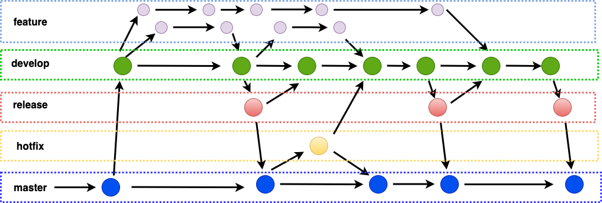

# **실습내용**



1. 프로젝트에 git flow init을 사용하여, master, develop, feature, hotfix, release branch를 구성한다.

2. develop branch에서 feature branch를 새로 끊어서 작업을 시작한다.

3. feature branch에서 tag를 확인한다.

```bash
$ git tag -l
```

3. 새로 끊은 feature branch에서 파일을 생성하고 add, commit한다.

4. release branch를 새로 끊어서 분기점을 만들고(branch name : version), 생성된 파일을 확인한 뒤에(실제로는 test/bug fix stage) release branch를 master와 develop branch에 merge시켜준다.

```bash
# release branch의 이름은 앞서 feature branch에서 확인한 version을 참고로 작성해준다.
# 별도로 v0.0.1 과 같은 형태로 작성을 해줘도 된다.
$ git flow release start 0.2.2
$ git flow release finish 0.2.2
```

5. 최종적으로 master branch에 tagging이 된것을 확인

```bash
$ git tag -l
```

6. 다음으로 release 된 master branch에서 심각한 issue가 발생했다는 가정으로 hotfix branch를 새로 끊어서 작업을 한다.

```bash
$ git flow hotfix start '0.1.1'
$ git flow hotfix finish '0.1.1'
```

7. 최종적으로 master, develop branch에서 tagging된 tag의 내용을 확인한다.

```bash
$ git tag -l
```
